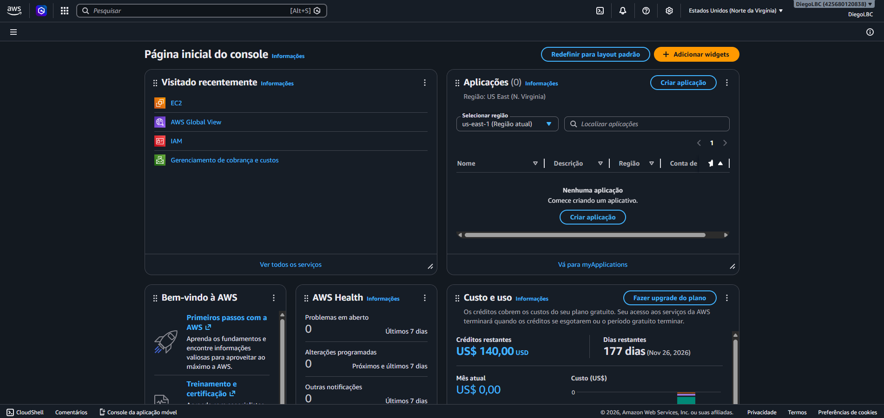
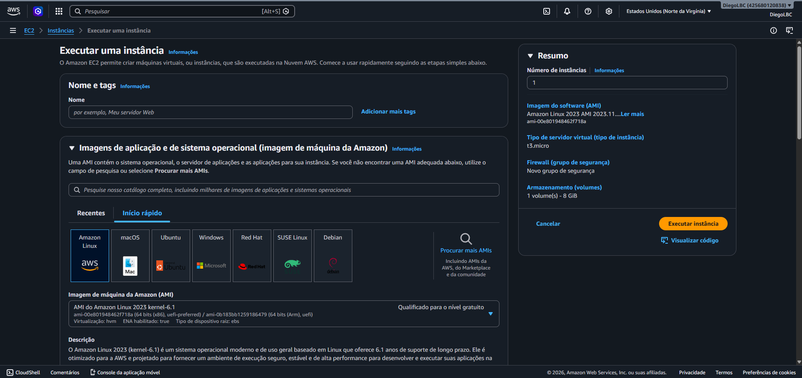
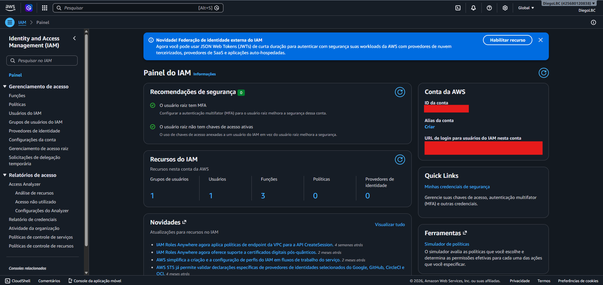
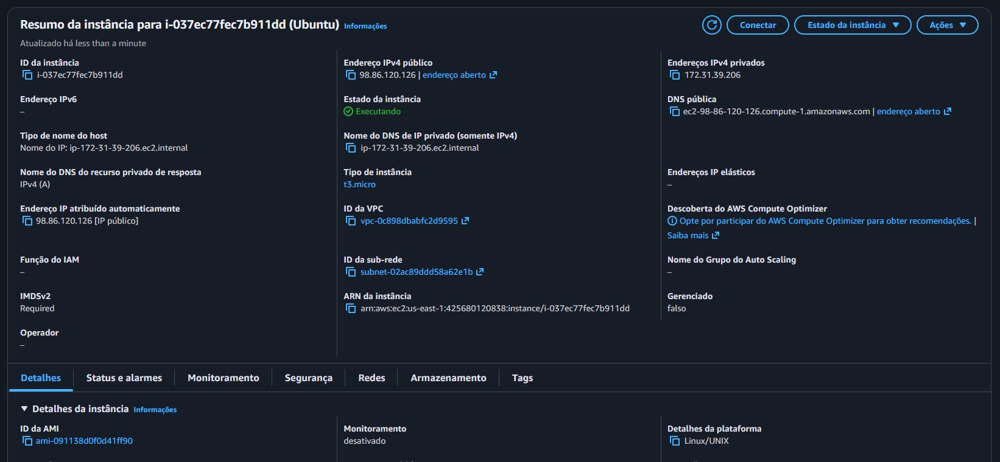

# Gerenciando Instâncias EC2 na AWS


## Descrição

Este repositório foi desenvolvido como parte do desafio prático do Bootcamp **GFT - Fundamentos de Cloud com AWS**, promovido pela DIO.

O objetivo deste laboratório foi consolidar os conhecimentos adquiridos sobre computação em nuvem e os principais serviços da AWS, com foco na criação, configuração e gerenciamento de instâncias EC2, além da aplicação de boas práticas de segurança, armazenamento e controle de custos.

## Status do Projeto

✅ Concluído

📚 Bootcamp: GFT - Fundamentos de Cloud com AWS

☁️ Plataforma: AWS

🎓 Instituição: DIO

---

## 📑 Índice

* [Objetivos de Aprendizagem](#objetivos-de-aprendizagem)
* [Tecnologias e Serviços Utilizados](#tecnologias-e-serviços-utilizados)
* [Serviços AWS Explorados](#serviços-aws-explorados)
* [Conteúdo Estudado](#conteúdo-estudado)
* [Aprendizados Obtidos](#aprendizados-obtidos)
* [Insights Pessoais](#insights-pessoais)
* [Evidências da Prática](#evidências-da-prática)
* [Estrutura do Repositório](#estrutura-do-repositório)
* [Conclusão](#conclusão)
* [Referências](#referências)

---

## Objetivos de Aprendizagem

* Compreender os conceitos fundamentais da computação em nuvem.
* Conhecer a infraestrutura global da AWS.
* Configurar uma conta AWS de forma segura.
* Aplicar boas práticas de gerenciamento de acesso.
* Entender mecanismos de controle de custos.
* Criar e gerenciar instâncias EC2.
* Utilizar os serviços Amazon EBS e Amazon S3.
* Documentar experiências técnicas utilizando GitHub.

---

## Tecnologias e Serviços Utilizados

* Amazon Web Services (AWS)
* Amazon EC2
* Amazon EBS
* Amazon S3
* AWS IAM
* AWS Billing Dashboard
* AWS Budgets
* Git
* GitHub

---

## Serviços AWS Explorados

| Serviço           | Finalidade                                     |
| ----------------- | ---------------------------------------------- |
| EC2               | Criação e gerenciamento de servidores virtuais |
| IAM               | Controle de acesso e permissões                |
| EBS               | Armazenamento em blocos para instâncias        |
| S3                | Armazenamento de objetos                       |
| Billing Dashboard | Controle financeiro                            |
| AWS Budgets       | Monitoramento e alertas de custos              |

---

## Conteúdo Estudado

### Introdução à AWS e ao Universo da Computação em Nuvem

A computação em nuvem permite disponibilizar recursos computacionais sob demanda através da internet, eliminando a necessidade de aquisição e manutenção de infraestrutura física própria.

**Principais benefícios:**

* Escalabilidade
* Elasticidade
* Alta disponibilidade
* Redução de custos
* Segurança
* Pagamento conforme o uso

---

### Fundamentos Essenciais da Infraestrutura AWS

A infraestrutura AWS é organizada em:

#### Regiões (Regions)

Locais físicos distribuídos globalmente onde a AWS hospeda seus serviços.

Exemplos:

* us-east-1 (Norte da Virgínia)
* sa-east-1 (São Paulo)

#### Zonas de Disponibilidade (Availability Zones)

Datacenters independentes dentro de uma mesma região que garantem redundância e alta disponibilidade.

#### Edge Locations

Pontos de presença utilizados para acelerar a entrega de conteúdo através de serviços como CloudFront.

---

### Configurando sua Conta AWS com Segurança e Eficiência

Durante o laboratório foram aplicadas boas práticas de segurança:

* Ativação do MFA (Autenticação Multifator)
* Proteção da conta Root
* Criação de usuários administrativos através do IAM
* Aplicação do princípio do menor privilégio

#### IAM (Identity and Access Management)

Serviço responsável pelo gerenciamento de:

* Usuários
* Grupos
* Funções
* Políticas de acesso

---

### Primeiros Passos com Acesso Seguro e Controle de Custos

Ferramentas utilizadas:

* AWS Billing Dashboard
* AWS Cost Explorer
* AWS Budgets

Benefícios:

* Monitoramento de gastos
* Alertas de consumo
* Planejamento financeiro

---

### Entendendo as Instâncias EC2 e a Otimização de Recursos AWS

O Amazon EC2 (Elastic Compute Cloud) permite criar servidores virtuais sob demanda.

#### Componentes Principais

* Amazon Machine Image (AMI)
* Tipos de Instância
* Key Pair
* Security Groups
* VPC (Virtual Private Cloud)

#### Estados da Instância

* Pending
* Running
* Stopping
* Stopped
* Terminated

---

### Armazenamento na Nuvem com Amazon EBS e S3

#### Amazon EBS (Elastic Block Store)

Serviço de armazenamento em blocos utilizado junto às instâncias EC2.

Características:

* Persistência dos dados
* Alta performance
* Snapshots para backup

#### Amazon S3 (Simple Storage Service)

Serviço de armazenamento de objetos utilizado para:

* Backups
* Arquivos
* Documentos
* Integração com outros serviços AWS

Benefícios:

* Alta disponibilidade
* Escalabilidade praticamente ilimitada
* Durabilidade dos dados

---

### Gerenciando Instâncias EC2 na AWS

Durante a prática foram executadas atividades como:

* Criação de instâncias EC2
* Configuração de Security Groups
* Criação de Key Pairs
* Inicialização de instâncias
* Parada de instâncias
* Reinicialização de instâncias
* Encerramento de instâncias

#### Security Groups

Funcionam como um firewall virtual responsável pelo controle do tráfego de entrada e saída da instância.

#### Monitoramento

A AWS disponibiliza integração com o CloudWatch para monitoramento dos recursos provisionados.

---

## Aprendizados Obtidos

Durante a realização deste laboratório foi possível compreender:

* O funcionamento da infraestrutura global da AWS.
* A importância da segurança em ambientes cloud.
* O uso do IAM para gerenciamento de usuários e permissões.
* Como controlar custos utilizando ferramentas nativas da AWS.
* O processo de criação e gerenciamento de instâncias EC2.
* As diferenças entre EBS e S3.
* Boas práticas para administração de ambientes em nuvem.

---

## Insights Pessoais

Durante a realização deste desafio, alguns conceitos se destacaram:

* A proteção da conta Root é uma das primeiras medidas de segurança que devem ser adotadas.
* O IAM permite um controle granular de acessos dentro do ambiente AWS.
* O EC2 oferece grande flexibilidade para provisionamento de servidores sob demanda.
* O S3 é uma solução extremamente escalável para armazenamento de arquivos.
* O gerenciamento de custos é tão importante quanto o gerenciamento dos recursos técnicos.
* A computação em nuvem simplifica a implantação e manutenção de infraestruturas modernas.

---

## Evidências da Prática

### Dashboard AWS



### Criação da Instância EC2



### Gerenciamento de Usuários e Permissões (IAM)



### Instância Ubuntu em Execução



---

## Estrutura do Repositório

```text
.
├── README.md
└── images
    ├── aws-dashboard.png
    ├── criacao-instancia-ec2.png
    ├── gerenciamento-iam-aws.png
    └── instancia-ec2-ubuntu.png
```

---

## Conclusão

A realização deste laboratório permitiu aplicar na prática conceitos fundamentais da computação em nuvem utilizando a AWS.

Os conhecimentos adquiridos servem como base para aprofundamento em Cloud Computing, Arquitetura de Soluções e Administração de Infraestrutura em Nuvem.

---

## Referências

* Documentação Oficial da AWS
* AWS EC2 User Guide
* AWS IAM Documentation
* AWS S3 Documentation
* AWS EBS Documentation
* Bootcamp GFT - Fundamentos de Cloud com AWS (DIO)

---

Desenvolvido por **Diego Leonardo Barbosa Cavalcanti** durante o Bootcamp **GFT - Fundamentos de Cloud com AWS** da **DIO**.
